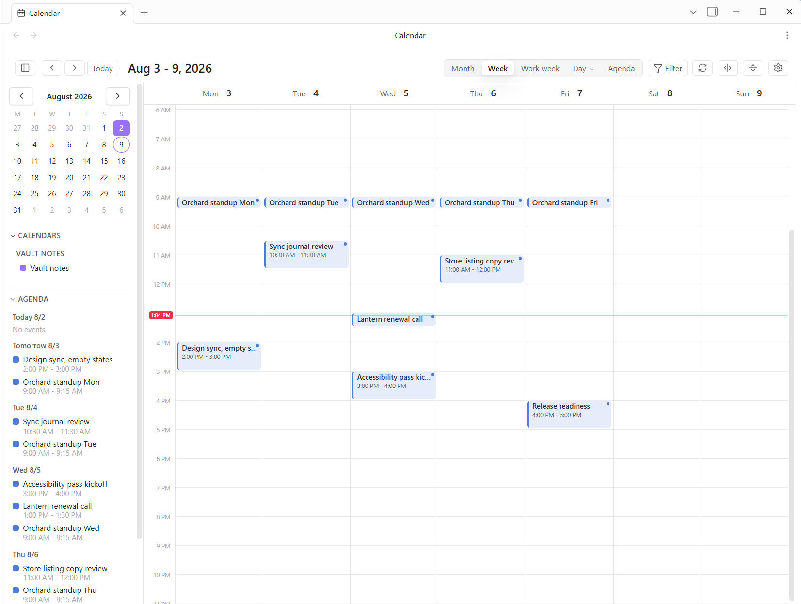

# Power Desk

Your calendars and mail inside Obsidian: Microsoft 365 (several accounts at once), Google Calendar, CalDAV (iCloud, Fastmail, Nextcloud), and ICS feeds in month, week, day, and agenda views, a triage inbox beside them, and a linked note for every event.



[](https://buymeacoffee.com/powerplugins)

Week view with the month picker and an agenda rail beside it. The source here is **Vault notes**, which turns any note with a date property into an event, so a vault can
fill a calendar with no account connected at all. Month, work week, day, and agenda sit
behind the switcher, and Filter narrows by calendar.

Formerly named Power Calendar; the plugin id changed to `powerdesk` with the rename, and settings migrate automatically on the first deploy. The ```` ```power-calendar ```` code block keeps working forever (```` ```power-desk ```` is its new alias), so existing daily-note templates are untouched.

Microsoft 365 and Google events are fully editable: create them by dragging across empty grid, move and resize them with the mouse, edit and delete from the event card. CalDAV and ICS stay read-only. Notes land in your vault, one per event, on your terms.

## Views

- **Month**: a classic grid. All-day and multi-day events render as banners across the week rows; timed events are chips inside each day. A crowded day collapses to "+N more", which jumps to that day.
- **Week**, **Work week** (Monday through Friday), and **Day**: a timed grid with side-by-side layout for overlapping events, an all-day strip on top, and a red line that knows what time it is.
- **Agenda**: the next N days as a readable list, with one-click join buttons for meetings.

The card can be dragged by its heading and resized from its corner, and it keeps both, like the other windows. The very first card lands beside the event you clicked, flipping above it when there is no room below; after that it opens where you left it. **Follow the event again**, on its menu, returns it to landing beside whatever you click.

Click any event for its card: time, calendar, location, organizer, attendees, description, RSVP buttons on invites, and the actions (join the meeting, open or create its note, edit, delete, open the original). When Power Assistant is installed, the card also offers "Capture meeting", which opens its New meeting dialog prefilled with the event's title, time, attendees, and Teams link.

**Find events** is the calendar's own search, movable and resizable and remembering where you left it: words anywhere in an event including its description, title, an organizer or attendee, a location, a calendar, a date range, and toggles for a join link, all-day, or having other people on it. Results appear **in the window** rather than replacing the calendar, since the answer to "when did I meet Deanna about Kore" is usually read rather than navigated to; clicking one lands the calendar on that day. It searches a year back and a year on by default, which is far enough for "when was that" without fetching a decade to answer one question. `Find event` remains beside it as the quick fuzzy jump when you already know an event's name.

Click the title in the header for a **mini month navigator**: density dots per day, arrows across months, one click lands anywhere. A **second time zone** (settings) draws its clock beside the hours in the week and day grids. And **Copy free slots** (command palette) reads your next five workdays and puts your open times on the clipboard as paste-able text, the serverless cousin of a scheduling link.

## Creating and editing events (Microsoft 365 and Google)

- Drag across empty space in the week or day grid to draft an event there; double-click for a half-hour slot; double-click a month cell for an all-day event, or drag across month cells for a multi-day one; press `C` or use the + button for a quick event at the next half hour.
- Drag an event block to move it (across days too); drag its bottom edge to resize. Escape cancels a drag. Times snap to 15 minutes.
- Edit and Delete live on the event card. Deleting a meeting you organize notifies attendees; deleting one occurrence of a series cancels just that occurrence. Deleted events land in your mailbox's Deleted Items, so they are recoverable.
- Microsoft 365 events are editable when you organize them and the account is connected with edit access; Google events are editable in any calendar where your account can write. Events from CalDAV and ICS sources never offer editing.
- With several writable calendars connected, the New event dialog offers a calendar picker; quick-create targets your default (Microsoft) or primary (Google) calendar.
- **Invite people** from the New event and Edit dialogs: email addresses, comma separated ("Bob <bob@x.com>" works too). Invitations and updates go out when you save; an untouched invite list is never resent.
- **Repeat** when creating: daily, every weekday, weekly, monthly, or yearly. Editing or deleting a repeating event asks whether you mean this occurrence or the whole series, exactly like Outlook; dragging one occurrence only moves that occurrence.
- **RSVP** right on the event card: invites you receive show Yes / Maybe / No, with your current answer highlighted; the organizer gets your response like any other reply.
- **Show as** Busy, Free, or Tentative when creating or editing; free events also stop blocking your Copy free slots availability.
- **Check availability** while drafting a Microsoft 365 meeting: free/busy bars for each invitee (same organization), your draft slot overlaid in red, and a per-person free / tentative / busy verdict that follows as you move the times. People the tenant gives you no visibility into show as such instead of failing the panel.
- The **New event window** opens at 720 by 700 and can be dragged and resized like the mail windows, remembering where you left it. Create leads its footer and Cancel sits away at the far end. A new event's **description** is a rich editor rather than a text box, with bold, lists, and links, and it is declared as HTML only when it actually contains markup, so a plain note still travels as plain text. Editing an existing event still shows no description field at all, deliberately: only a preview of the real one was ever fetched, and writing that back would truncate what is there.
- **Email attendees** from any event card: a small compose with everyone addressed and the event as the subject, sent from your own mailbox (or handed to your mail app).

## Mail

Calendar and mail share the same accounts, so Power Desk carries a **triage inbox**: recent messages across every mail-enabled Microsoft account in one list (unread bold, an account color dot per row), a text-first reading pane, reply, archive, and compose. Two bridges make mail belong here:

- **Make event**: an email becomes a prefilled New event dialog, with the sender already invited and the reply prefixes stripped from the title.
- **Save to note**: the message lands in your vault as a dated note with the text and a link back to the original.

**Print the calendar** from its toolbar or the "Print the calendar" command. It opens the same print window the mail uses, with the two shapes a calendar has on paper: an **agenda**, a day-by-day list of what is actually happening with times and places, covering whatever range is on screen; or the **month grid**, the whole month around where you are, laid out as the grid and asking the printer for landscape rather than hoping. Month view starts on the grid and everything else on the agenda, because a timed week grid on paper turns an hour into a few millimetres and a busy day into a smear, while the list reads at arm's length. Switching between them redraws the preview from the right range rather than reusing the other one's. A day with nothing on it says so rather than quietly vanishing.

The **calendar has a toolbar of its own**, arranged the same way from the gear at its end or from Settings: Filter, Refresh, Find event, Copy free slots, Print, Today, New mail, Inbox, Events base, and Test reminder, in whatever order you want. What is deliberately not in it: the back and forward arrows, the title, and the Month / Week / Day / Agenda switcher. Those are the view rather than actions on it, and a calendar you cannot page or switch is not a calendar.

The mail **toolbar** carries every action on the selected message and is yours to arrange: New mail always leads, then whichever of Delete, Report, Reply, Reply all, Forward, Read / Unread, Flag, Snooze, Move, Archive, Make event, Save to note, Create a rule, and Open in Outlook you want, in your order. The gear at its end (or Settings) opens the editor. It ships in Outlook's own order, which is what the hands already know, and anything left off keeps its keyboard shortcut, its right-click entry, and its palette line, so a short toolbar gives up nothing. The reading pane carries no button row of its own: it was the same actions twice.

**Report** offers three things. **Report as junk** blocks the sender and files the message in Junk Email, on Graph's supported v1.0 action. **Report phishing** and **Report as not junk** send the message on to Microsoft's filters, and both are marked *(preview)* in the menu because they run on Graph's `/beta` endpoint, which Microsoft states outright is not supported for production and may change without notice; there is no v1.0 equivalent, since `markAsJunk` covers only the junk half and its `notJunk` twin was retired. All three confirm first, and a preview report that fails says so plainly rather than quietly doing something else instead. If the preview ones ever stop working, Outlook's own Report button always will.

**New mail announces itself.** A notice names who wrote and what about, and clicking it opens that message; when Obsidian is not the window in front, a desktop notification goes with it. It ships set to **Focused only**, following Outlook's own verdict so the Other pile stays quiet, and can be set to everything or nothing. Three things it deliberately never does: announce anything on the first check after Obsidian starts (the mail already sitting there is not news, and neither is what arrived while it was closed), announce the same message twice, or announce mail you have already read somewhere else. A red unread count rides on the mail ribbon icon, which can be turned off on its own.

**New mail arrives on its own.** An open mail view checks every 30 seconds by default (settings; up to 5 minutes, or off to leave it to the calendar's much slower refresh), and checks immediately whenever you come back to the window or to the mail view, which is when stale mail is most obvious. Mail syncs by delta, so a check that finds nothing is one small request per account. Only what you are looking at is polled: the inbox lists, the folder tree's unread counts, and the folder currently open; other folders you have visited refresh when you open them, rather than spending quota redrawing thirty lists a minute. Nothing polls while the mail view is closed.

A **folder pane** on the left shows each account's full folder tree with unread counts, your filed subfolders included, exactly as in Outlook. **Folders are yours to manage**: right-click an account header for a new folder at its root, or any folder for a subfolder, a rename, or a delete. The folders the mailbox runs on (Inbox, Drafts, Sent Items, Deleted Items, Junk, Archive and the rest) do not offer rename or delete, since Graph would refuse anyway and a raw error after the fact is a poor way to learn that. Deleting says how many messages and subfolders go with the folder, and points at Outlook's Recover Deleted Items rather than promising a particular outcome. A deleted folder is also dropped from your favorites, recents, hidden list, and hand-made order, so nothing is left pointing at an id that no longer exists.

The **panel button** at the left of the mail and calendar headers folds the whole left sidebar away, giving the view everything except the ribbon down the far edge; the mail folders stay, since they are the point of the view. Clicking anything on the ribbon brings the sidebar back, so the window is never a mode you cannot leave, and the "Focus mode" command does the same if you would rather bind a hotkey. **Nothing else moves your layout**: opening mail or the calendar leaves the workspace exactly as you had it, sidebar panes and all, because a window that rearranges itself as you change tabs is unsettling however sensible each rearrangement is. The sidebar is collapsed through Obsidian's own API rather than hidden with CSS, so the app knows it is shut and its own toggles keep working.

**Automatic replies** set your out-of-office per account, on until you turn it off or between two times, with one message for colleagues and another for outsiders (nobody, contacts only, or everyone). The mailbox sends them, so they go whether or not Obsidian is open, and they are the same replies Outlook shows. While one is running a band across the top of the inbox says so and offers to turn it off, which is the part that stops an away message answering for a fortnight after you got back. Times are stored absolute in UTC, since which timezone spellings Exchange accepts is a swamp and a reply that starts an hour out would say nothing about it.

**Categories** are the mailbox's own, the same list Outlook's Categorize menu shows, in the same colors. `G`, the toolbar's Categorize button, or the right-click menu ticks them on and off; a category shows as a colored square in the row's marks and as a named pill in the reading pane. Over a multi-selection a ticked category means every message has it, so one press puts it on all of them and the next takes it off all of them, the same rule the flag follows. It reads under the permission inbox rules already granted, so no reconnect. **Manage categories** (from the Categorize menu, settings, or the palette) makes new ones, recolors them from Outlook's own twenty-five, and deletes them.

There is no rename, and that is Graph's limit rather than an omission: its documentation states outright that a category's display name cannot be modified once created, only its color. **Replace everywhere** is the honest substitute, and it is named for what it does rather than dressed up as a rename. It counts every message carrying the old name first and tells you the number, makes the new name in the same color, retags them twenty at a time, and retires the old category **only if every rewrite succeeded** — a partial run leaves the old one in place so nothing is left orphaned without a color or a way to find it, and running it again finishes the job. It reaches mail alone: calendar events, tasks, and contacts keep the old name and need Outlook, which the confirmation says plainly. Deleting a category takes it off the list without stripping the label from messages that already carry it.

**Sender photos** put a colleague's real picture where their initials would be, taken from your organization's directory. Outside senders almost never have one and keep the lettered circle. This needs the delegated `ProfilePhoto.Read.All` permission and a Reconnect; until then it quietly does nothing. Faces are fetched a few at a time as a list draws, then cached to disk so they are there on the next launch.

**Drag a folder onto a sibling** to put it there and it stays put, so the folders you live in can sit at the top instead of wherever the alphabet puts them. Only the folders you actually move are remembered; everything else stays alphabetical behind them, which means arranging three folders does not freeze the other thirty or hide a new one when it appears. The inbox keeps the top of its account until you drag it yourself, dragging never crosses accounts or reparents anything (it is a display order, not a mailbox change), and right-clicking an account header restores the alphabet. Folders with children carry a collapse chevron; a collapsed branch rolls its whole subtree's unread count up onto itself, and the folds are remembered. The account header folds too, taking the whole mailbox with it and wearing the account's unread total while closed. Above each tree sits **Unread Mail**, the Outlook-style search folder: every unread message across the inbox and all its subfolders in one list, each tagged with the folder it lives in, and (with the keep-unread option on) nothing marks itself read while you walk it. Marking one read there does exactly that and no more: the bold and the blue bar go, and the row **stays where it is** until you press Refresh, so you can put it back to unread if you did not mean it. New mail still arrives in the list on its own; it is only the messages you touched yourself that are held, and only until you ask for a refresh. The same holds under the Unread filter. Click any folder to browse it; its first message opens in the reading pane right away (without marking anything read on its own), "All inboxes" on top returns to the unified list, and the panel button in the header collapses the pane. On phones and narrow panes the view drills one screen at a time instead, exactly like the phone Mail app: Mailboxes, then the message list, then the message, with back in the header. Hover any message for quick actions right in the list: reply, mark read or unread, archive; the reading pane carries the same plus Mark unread after a message auto-marks itself read. An **Unread filter** in the header shows only unread mail (with a live count), keeping the message you are reading visible until you move on. **Mark-as-read behavior** is yours to pick in settings, exactly as in Outlook: on selection, a few seconds after selection, when the selection changes, or only by hand; and while the Unread filter is on, an option keeps everything unread unless you explicitly mark it. **Message preview** in settings sets how many lines of body text sit under each row, the same Off / 1 / 2 / 3 that Outlook's View menu offers. It ships Off, matching Outlook Classic: sender over subject and nothing else, which fits about half again as many messages on a screen.

The list is **keyboard-first**. With it focused: `J`/`K` (or the arrows) walk the messages, `↵` opens, `U` backs out, `→`/`←` open and close a conversation. `R` replies, `A` replies all, `F` forwards, `C` starts new mail, `E` archives, `X` ticks the row, `S` flags for follow-up, `B` snoozes, `V` files it into a folder, `Shift+I` and `Shift+U` mark read and unread, `Del` deletes and `Shift+Del` deletes for good. `/` searches the mailbox and `?` brings up the whole card. Nothing fires while the caret is in a field, so typing a subject stays typing a subject.

`Ctrl`/`Cmd`+`K` opens the **command palette**: every folder in every account and every action that applies right now, behind one fuzzy search, so you never have to know whether what you want is a place or a verb. It reaches the folders, the saved search folders, reply and archive and delete, Make event and Save to note, and the view toggles (conversations, unread filter, density, message preview). "Mail command palette" and "Mail keyboard shortcuts" are on the vault's own command list too, so they can take a global hotkey.

**Row density** in settings gives the list compact, cozy, or comfortable spacing, independently of how many preview lines each row shows.

The mail view draws its accent in **mail blue** rather than the vault's accent color, so the subjects, the unread bars, and the buttons read the way a mail client reads instead of inheriting whatever the theme picked. Nothing outside the mail view is touched.

The **split inbox** groups the list into sections the way Spark and Shortwave bundle one: **Priority** (flagged or high importance), **Focused** and **Other** (Outlook's own verdict, the same one its Focused Inbox uses), and **Notifications** (senders whose address is a machine's). Notifications sits above Other on purpose, because ticket and build mail is work and burying it would hide the automated mail that actually needs answering. A person mailing from a ticketing domain still reads as a person. Sections carry a count with the unread part called out, fold shut and remember it, and stay stuck to the top while you scroll them. It applies to the triage surfaces (the unified list, an inbox, Unread Mail); a folder you file into stays flat, and a search always does. Conversations still group inside each section.

**Conversations** group a back-and-forth into one row, Outlook's Show as Conversations. The collapsed row carries everyone who wrote, the message count, and the marks off every message in it, so an attachment three replies down is still visible from the list; the twisty on its left opens the thread in place, and the reading pane lists the whole conversation so you can walk it without going back. Ticking, archiving, marking, or deleting a collapsed conversation takes all of it, exactly as Outlook does. Search results are never grouped on purpose: a search asks about messages, and burying a match inside a collapsed thread would misreport what matched. Toggle it in settings or from the sort button in the list header.

Rows are laid out the way Outlook lays them out: the sender on top in text color, the subject beneath it in the accent color on every row (unread only adds weight), and the date right-aligned at the end of the subject line. The end of the sender line carries the marks, an attachment paperclip, a red flag, and a red `!` for high importance; those step aside for the quick actions when you hover a row, so the date never moves and stays readable the whole time.

**Inbox rules** are the same rules Outlook shows, edited here (settings, the command palette, or the mail palette). They run in the mailbox rather than in Obsidian, so mail is filed whether or not this is open and on every device you read mail from. Conditions: from, subject, body, sent-to, has an attachment, marked high importance. Actions: move to a folder, mark read, set importance, delete, stop processing later rules. A live sentence under the editor says what the whole thing will do before you save it.

The most useful way in is **"Create a rule from this..."** on any message's right-click menu, which opens the editor with the sender already filled in. Power Desk edits a common subset of what a rule can do, so a rule that also carries conditions or actions it cannot show says so plainly in the list and in the editor, and keeps them exactly as they are when you save; nothing set in Outlook is ever quietly dropped by an edit made here.

**Move to folder** files mail without leaving Obsidian. `V` opens a fuzzy picker over the whole folder tree, showing each folder's full path so two folders with the same name under different parents can be told apart, with the folders you have filed into lately at the top. Those recent folders also sit directly on the right-click menu, since the same three or four take almost everything. You can drag a message onto any folder in the pane or onto a favorite, and a row that is part of a ticked selection drags the whole selection, so tick-tick-tick-drag files a batch at once. Rows leave the list immediately rather than waiting on the mailbox, the way archive and delete already do. A move cannot cross mailboxes, so only folders in a message's own account light up while dragging, and moving a selection that spans two accounts files the part that belongs and says how many stayed put.

**Unsubscribe** appears beside the sender's name on any message whose headers say how to leave, rather than in six-point grey at the bottom of the mail where it is meant to be hard to find. Where the sender supports one-click unsubscribe (RFC 8058) Power Desk posts it directly and nothing but the standard's own request body is sent; otherwise it opens the sender's page in your browser, or mails their unsubscribe address. It always asks first and the question names the exact destination, because these addresses come from the message itself: they are the sender's claim about where to go, and a link dressed up as an unsubscribe is exactly the sort of thing that arrives in mail. Reading the headers costs no extra request, since they come back with the body.

**Print** opens a window rather than the system dialog: pick a style, look at the page, then print the page you looked at. The preview is the document itself, and Print sends that same frame to the printer, so there is no second rendering that can disagree with what you saw. **Style** offers Outlook's two: **Memo**, the message laid out as its own page with the subject as a heading, From, To and Date above a rule and the body beneath; and **Table**, the list as it is on screen, in the order it is on screen, From, Subject, Received and Folder, with the headings repeating on every page and no row split across a page break. **Size** runs from Smallest to Largest around each style's own Normal, since the right size for a message is not the right size for a month grid. **Paper** is Portrait or Landscape, remembered per style, so the month grid stays sideways without making everything else sideways too. Size and orientation are remembered on this computer.

**Print** sits on the mail toolbar, and on the calendar's. It is also on the right-click menu, the sort button's menu, and the palette. Unlike the other toolbar actions it needs no message selected: with one it opens on the memo, with several or none it opens on the table, since a list is a thing you can print without having picked anything out of it. Whichever way you came in, both styles are in the window; the one you asked for is simply the one already showing. It prints the mail rather than the window: asking Obsidian to print would give you the sidebar, the folder tree, the message list, and whatever slice of the mail fit beside them. Inline images are resolved first, so the logos come out. Desktop only, since printing on a phone is the operating system's business.

**Receipts**, from Options in the compose window: ask the recipient's mail app to confirm they opened the message, or their server to confirm it arrived. Settings can start every message with either. These are the standard mail fields Outlook sets, carried in the headers, so the recipient's own software decides whether to answer and every serious one asks them first and lets them refuse. Which also means a receipt that never comes tells you nothing in particular. Power Desk does not do the other kind of read tracking, the invisible pixel that reports back without the reader knowing; that needs a server of its own and it works by not asking.

**Signatures** work the way Outlook's do: as many as you want, named, with each account choosing one for new messages and a different one for replies and forwards, since the full block belongs on a first message and rarely on the fourth reply of a thread. The editor is the same rich one the compose window uses (bold, italic, lists, links) plus **Insert an image**, which takes a logo straight from the vault, so nothing needs hand-written HTML. A signature made before this existed is carried into the list automatically and set on every account. The signatures, rules, rule editor, categories, and automatic replies windows can all be dragged by their titles and resized from their corners, and each opens where you left it. Each remembers its own size, since a tall form and the list beside it should not have to agree on one. Positions are kept per computer rather than in the vault, because where a window sits on a 34-inch monitor is not where it should sit on a laptop, and a remembered spot is clamped back on screen if the display has changed.

Embedded images are the part that usually goes wrong elsewhere. They live as data URLs while you edit, which keeps a signature self-contained, and are converted to proper **inline attachments with content ids** the moment a message is sent, because Outlook and Gmail have blocked data-URL images for years and a logo sent that way simply does not appear for the person reading it. A plain message that would otherwise skip the draft step is routed through one when it carries an image, since an attachment needs a draft to hang off.

The **compose window** opens at 900 by 720 and can be dragged and resized like the others, remembering where you left it. **From** is a real account picker when more than one mailbox can send, and changing it swaps the signature to that account's without touching a word you have typed; a reply shows its mailbox as a label instead, since its draft already lives there and moving it is not a dropdown. **Bcc** sits one click off the To row. The formatting bar carries bold, italic, underline, strikethrough, lists, links, and an image from the vault, then text size, text color, highlight, left/center/right, indent and outdent, blockquote, and a divider. **Send** leads the footer and looks like it, with Attach, Options and Send later beside it and Discard pushed away to the far end where it cannot be hit by accident.

**Attach files** to what you send, from the **vault** or from the computer. The vault picker comes first and lists every file, newest first, because in Obsidian the thing worth sending is usually already an asset sitting beside a note, and it works identically on desktop and on a phone where no file dialog exists. Attached files show as the same colored chips the reading pane uses, with a running total and a warning past 30 MB, since most mailboxes refuse a message around 35 MB. Files under 3 MB go up in one request and larger ones through a chunked upload session, so a big PDF is not a special case. They upload when the message actually sends rather than when you pick them, which keeps attaching instant and means taking the undo costs nothing.

**Undo send** holds a sent message for a few seconds (settings; 8 by default, or off) while a notice offers Undo. The compose window closes the moment you press Send, because sending should feel done; the message simply has not left yet. Taking the undo puts the window back exactly as it was, the same draft and the same body, so nothing is retyped and no second draft appears in your mailbox. The hold is client-side, so quitting Obsidian during the window matters: a normal quit or a plugin reload lets anything waiting go on its way, but a force quit cannot, which is why the choices are seconds rather than minutes. Scheduled sends skip the hold, since they already sit in Drafts until their time.

**Shortcuts** (the command palette, or either toolbar) is Outlook's shortcuts list with something worth pointing at: a mail folder, a saved search, a note in the vault, or a link, in named groups you arrange yourself. That is the one list neither application can offer alone, the folder you file into and the note you write in it side by side. Rename, group, reorder, remove; a note that has left the vault says so rather than failing silently.

**Folders** (the command palette, or either toolbar) is the whole tree of every account at once, for looking after folders rather than getting to one: item and unread counts on each, a filter for a mailbox with sixty of them, the hidden ones shown greyed rather than absent, and per folder a new subfolder, a rename, hide or show, and **mark everything read**. That last one is the reason the window earns its place: the mailbox has no bulk read flag, so it is one write per message twenty at a time, with a running count, and it says what it actually managed rather than claiming the folder is clear. Filtering flattens the indentation, since indenting a filtered list under parents you cannot see is just a ragged edge. Clicking a folder opens it in the inbox.

**Journal** (the command palette, or either toolbar) is a day at a time: the meetings you sat in, what you sent, what arrived, and the notes you touched, with arrows to walk the days. It is built from your mail and calendar rather than from Outlook's old Journal folder, which Microsoft stopped writing to years ago and which is empty in almost every mailbox; what it records is what that folder used to. Declined meetings are left out, because you did not attend them. **Add to the daily note** writes the day into that day's note in your vault as markdown, appending rather than overwriting and refusing to add the same day twice, since a daily note is your writing and this is a guest in it. Copy puts the same markdown on the clipboard.

**Outlook notes** (the command palette, or either toolbar) reads, writes, and deletes the sticky notes in your mailbox, and **needs no extra permission**. Graph has no notes endpoint and never had one, which is why the usual answer is that it cannot be done; but Outlook's notes are ordinary items in the Notes folder wearing the message class `IPM.StickyNote`, so the mail permission already reaches them. Write one here and it appears in Outlook, because it is the same note. Click one to read it in full, search across them, and **Save to the vault** turns one into a real note beside the rest of your writing, which is the thing Outlook cannot do. Deleting one puts it in Deleted Items, since a note is an item in the mailbox and recoverable like any other.

**Tasks** (the command palette, or add it to either toolbar) shows your **Microsoft To Do** lists and your **flagged mail** in one window, which is what Outlook's To-Do bar shows and for the same reason: the things you wrote down and the messages you meant to come back to are the same list in practice. Pick a list, tick things off, add one with a line and a return (with a due date if you want), delete, and show or hide what is done. Overdue dates are called out in red. Flagged mail sits underneath, and clicking a message opens it in the inbox while the flag itself clears from here. Ticking a task lands before the mailbox answers, like every other action. Due dates are read as days rather than instants, so a task due Friday does not show as Thursday. The To Do half needs the delegated `Tasks.ReadWrite` permission and a Reconnect; the flagged half needs nothing and works either way.

**People** (the command palette, or add it to either toolbar) is the address book this vault can actually build: everyone you have written to, everyone who has written to you, and everyone you have met, ordered by how much you deal with them rather than by whether anyone remembered to save them. Each row carries their photo, their address, how many messages, and when you last heard from them, and four actions that only make sense here: write to them, find their mail, find your meetings with them, and open their page in the vault. Clicking a row copies the address. Your mailbox's **saved contacts merge into the same list**, marked as such, bringing their job title, company, and phone with them; a contact you have never written to still appears, sitting after everyone you actually correspond with, and a colleague you write to daily who was never saved sits at the top where they belong. The address book's spelling of a name wins over one scraped off a From line, since one was chosen and the other is whatever that sender happened to set. Saved contacts also turn up in recipient autocomplete, which is most of the point of saving one. This part needs the delegated `Contacts.Read` permission and a Reconnect; until then the window says so and lists the correspondence alone, which needs nothing.

**Recipient autocomplete** in the To and Cc boxes: start typing a name or an address and the people you actually correspond with come up, ranked by how often and how recently. Arrows move, `↵` or `Tab` takes the highlighted one, `Esc` dismisses. It matches on the address and on any word of the name, so "palm" finds Steve Palm and a prefix always beats a match in the middle. The list is built from who you have written to (Sent Items), who has written to you (every cached message), and who you have meetings with (the calendar), so it needs no extra mailbox permission and no reconnect.

**Snooze** (`B`, the right-click menu, or the reading pane) parks a message until a time you pick: later today, tomorrow morning, the weekend, next week, or any time from the picker. It moves into a **Snoozed** folder in your real mailbox, created on first use, and comes back to the inbox unread when its time arrives. Graph has no server-side snooze, so the return leg runs here, which means a message due while Obsidian is closed comes back the next time you open it. Parking it in a real Outlook folder rather than hiding it in the plugin is deliberate: the worst case is a visible folder you can file by hand, not mail that has vanished. The palette lists what is waiting and can pull any of it back early.

**Send later** sits beside Send in the compose window and is genuinely server-side: the message goes to your mailbox with a deferred delivery time on it and Exchange releases it at that moment, so it goes out whether or not Obsidian, or the computer, is running. It waits in Drafts until then, where Outlook can still edit or cancel it.

**Flags** write back to the mailbox, so a follow-up flag set here shows up in Outlook and vice versa. Set or clear one with `S`, the flag in a row's hover actions, the right-click menu, or the button in the reading pane; click a flag already showing on a row to clear it, the way Outlook's flag column works. Flagging a collapsed conversation flags all of it, and the Flagged filter in the list header narrows to what you have marked.

**Attachments** ride a bar under the message actions, each on a chip with a colored file-type tile: PDF red, Word blue, Excel green, PowerPoint orange, images purple, archives amber, and so on down to a neutral gray for anything unrecognized, so a bar of files is scannable by color before a single name is read. The chip carries the name, the size, and a chevron that drops its actions directly underneath it: **Preview** opens the file in an Obsidian tab (PDFs, images, audio, and video all render there), **Open** hands it to the operating system's default app, **Save to vault** and **Save to folder** write it where you want it, and **Copy name** takes the filename. A message with several attachments gets a **Save all** button at the head of the bar. Open the view from the mail ribbon icon or the "Open inbox" command. The **search button** in the header searches twice over. Typing runs against a **local index** of the mail already on this device and narrows on every keystroke, with no network at all; pressing `Enter` runs the same words against the whole mailbox of every account, Outlook style, and merges what comes back. The title says which you are looking at ("14 here" against "14 in the mailbox"), because those are different claims and a search that quietly under-reports is worse than a slow one. The index knows every message it has cached and the body of every message whose body has been read, so it finds more the longer a mailbox is used.

Beside it sits an **advanced search window**, Outlook's Find in the shape this mailbox supports: words, an exact phrase, from, subject, unread, flagged, has an attachment, and a date range, with buttons to run it here or against the whole mailbox. It is movable and resizable and remembers where you left it. The fields compose the ordinary query text and **show you what they built**, so the dialog is a way into the syntax rather than a second search that merely resembles it; the query lands in the search box afterwards, ready to be edited by hand.

The search box speaks a small query language, local and server alike: bare words (matched as prefixes, so results narrow as you type), `from:name`, `subject:word`, `is:unread`, `is:read`, `is:flagged`, `has:attachment`, `after:2026-01-31`, `before:2026-02-28`, and `"an exact phrase"`. Words combine with AND, and a hit in the subject or the sender outranks one buried in a body. A mailbox search only asks the server what it can actually answer (words, phrases, from, subject); the flags and the date range are applied here, to the server's results as well as ours, because Graph given `is:unread` goes hunting for messages containing that string and looks like it worked. Results are tagged with their folder and newest first. What it still leaves to Outlook: renaming a category outright, which the Graph API does not allow at all, and changing a category on calendar items. "Open in Outlook" is one click for anything deeper. Mail arrives per account after a one-time Reconnect that grants the mail permission (the Azure app registration needs delegated `Mail.Read` and `Mail.Send` added, plus `MailboxSettings.ReadWrite` for inbox rules, `ProfilePhoto.Read.All` for sender photos, `Contacts.Read` for saved contacts, and `Tasks.ReadWrite` for To Do, each of which lives under its own permission rather than the mail one). Each account row in settings has an inbox toggle, so a calendar-only account stays calendar-only.
- **Duplicate** any event from its card into a prefilled New event dialog.
- **Meeting reminders**: while Obsidian is open, a card slides in before each timed meeting (lead time in settings, 0 turns it off): the meeting, how long you have, the time, and where, with a one-click **Join**. It waits to be dismissed rather than timing out, and **Snooze** puts it back in five minutes (or at the start time, whichever comes first). "Where" names the service (Zoom, Teams, Google Meet, Webex) instead of printing the join link, since the link is what the button is for, and a room name shows as itself. Declined meetings and all-day events stay quiet. **Show a test meeting reminder** (command palette) brings the card up on demand, built from your next meeting today at your configured lead time, so you can see what it will look like without waiting for one.
- **Week numbers** (settings): ISO week labels in the month rows and the week header.
- Editing never rewrites an event's description: the plugin only fetches a preview of the body, and writing that back would truncate the real one.

## Keyboard

The view is keyboard-first. With the calendar focused:

| Key | Action |
| --- | --- |
| `T` | Today |
| `M` `W` `D` `A` | Month, Week, Day, Agenda |
| `5` | Work week (Monday through Friday) |
| Left / Right | Previous / next period |
| `C` | New event at the next half hour |
| `/` | Find event |
| `R` | Refresh now |
| `Esc` | Close the event card, cancel a drag |

## Your agenda inside any note

Put a `power-calendar` code block in a note and the day's events render right there, Live Preview safe:

````
```power-calendar
```
````

With no options, the block reads the day from the note's own filename (a daily note named `2026-07-18 Saturday` shows that Saturday), falling back to today. Options, one per line: `date: 2026-07-20` pins a day, `days: 3` widens the span. Rows show time, title, location, and a join button; clicking one opens the calendar on that day. Drop the block into your daily-note template once and every day has its agenda.

There is also **Find event** (`/` in the calendar, or the command palette anywhere): fuzzy search over the coming two months of events by title, day, calendar, or attendee; Enter lands the calendar on its day.

## People and bases

Attendee and organizer names on an event card are links: click one to open that person's page (created on first visit) in your People folder, which borrows Power Assistant's when it is installed, so meetings connect to the same person hubs its captures build. And **Create events base** (command palette) drops a ready-made Bases table over your event-notes folder, using Power Bases' table when present.

On phones, the calendar opens in the view you pick under "Default view on phones" (agenda by default, which reads best on a narrow screen), and chips, rows, and buttons grow to finger size.

## Notes per event

Every event can carry a note. "Create note" on the event card writes one with queryable frontmatter (date, calendar, location, organizer) and the attendees as `[[links]]`, so people pages connect on their own. Events whose note already exists show a small dot. The folder and filename template are settings; templates know `{{date}}`, `{{time}}`, `{{title}}`, and `{{calendar}}`.

## Sources

Settings has a tab per source (Microsoft 365, Google, CalDAV, ICS feeds, and Vault notes), each with its own "Add account" button. Each account row expands to its calendars (toggles and colors) and can carry a friendly name; each calendar gets its own status chip in the footer, and everything refreshes on the cadence you pick. Several accounts of the same kind can be signed in side by side (work plus personal Microsoft accounts, more than one Google account).

### Microsoft 365

Your Outlook calendars through **your own** Azure app registration, with full event editing. Sign-in uses the device-code flow: the plugin shows a code, you approve it in your own browser, and no password ever touches Obsidian. This flow also works on phones and tablets, where browser-redirect sign-ins cannot.

Setup, once: press "Show the steps" in settings (Microsoft 365 tab) for a walkthrough of the Azure portal with the exact value for every field. In short:

1. In your browser, open portal.azure.com signed in with the account that should own the app, then App registrations, New registration. Supported account types: "Any Entra ID Tenant + Personal Microsoft accounts" (older portals word it as "accounts in any organizational directory and personal Microsoft accounts"); Redirect URI: empty.
2. Under Authentication, turn on "Allow public client flows".
3. Paste the Application (client) ID from the app's Overview page into the plugin's settings and press Connect. Single-organization apps also need the Directory (tenant) ID in the Tenant field.

You consent to the calendar and mail permissions at first sign-in; only organizations that block user consent need an admin to grant the delegated `Calendars.ReadWrite`, `Mail.Read`, and `Mail.Send` Microsoft Graph permissions under API permissions.

If Power Assistant is installed and already connected to Microsoft 365, Power Desk borrows its app registration automatically and step 1 through 3 disappear; you still sign in once, and your calendars appear.

A connection made by an older version of this plugin was consented read-only. It keeps working exactly as before; press Reconnect in settings once to grant edit access.

After connecting, every calendar in the account is listed in settings with its own toggle and color.

Personal outlook.com accounts: an app registered as "this organizational directory only" cannot sign them in. Press Add account and pick Personal: the account signs in through its own app registration, which the wizard creates with you on the spot (owned by the personal account) or reuses silently from an earlier personal account. The app is remembered on the account row, so reconnects use it automatically. Alternatively, widening the shared app's supported account types to include personal accounts makes the separate app unnecessary.

### Google Calendar

Google requires **your own** (free) Google Cloud project, because Google's terms forbid shipping shared credentials inside an open-source plugin. One-time setup, about five minutes:

1. At console.cloud.google.com, create a project.
2. APIs & Services, Library: enable the **Google Calendar API**.
3. APIs & Services, OAuth consent screen: choose **External**, fill the required fields, and press **Publish app**. Do not leave the project in Testing mode: test-mode refresh tokens expire every 7 days, which reads as being signed out weekly. Publishing an app you never submit for verification simply means a one-time "Google hasn't verified this app" warning at sign-in (Advanced, then continue).
4. APIs & Services, Credentials: create an **OAuth client ID** of type **Desktop app**. Paste its Client ID and Client secret into Power Desk's settings under "Google app".
5. Press Add account, pick Google, and finish the sign-in in your browser.

Sign-in itself runs on desktop (the browser hands the code back to Obsidian on a local port); after that the connection syncs to phones and tablets with the vault, where reading and editing work normally.

### Vault notes

The source no other calendar can have: your own notes. Add a vault source (a folder filter plus the frontmatter property holding the date) and every matching note renders as an event beside your real calendars. A bare date (`2026-07-17`) is all-day; a datetime (`2026-07-17T09:30`) is timed; an optional end property stretches either. Click the event to open the note. Drag a timed one and its frontmatter date is rewritten, which makes deadlines reschedulable from the calendar. Everything is local: no network, updates appear as you edit notes.

### CalDAV

iCloud, Fastmail, Nextcloud, Radicale, and anything else speaking CalDAV. Add an account with its server URL and credentials, and the plugin discovers the calendars and lists them with toggles.

- **iCloud**: server `caldav.icloud.com`, your Apple ID as username, and an app-specific password from appleid.apple.com (your normal password will not work).
- **Fastmail**: server `caldav.fastmail.com` with an app password.
- **Nextcloud**: `https://your.server/remote.php/dav` with your normal or app credentials.

### ICS feeds

Read-only iCalendar subscriptions: a published Outlook or Google calendar, the team schedule, holidays. Paste the URL (`webcal://` links work) and name it.

## Network use

This plugin talks to the network only for the calendars you configure:

- `login.microsoftonline.com` and `graph.microsoft.com` for Microsoft 365 sign-in, calendar access, and mail (inbox reads, replies, and sends you make yourself), only after you connect an account.
- `accounts.google.com`, `oauth2.googleapis.com`, and `www.googleapis.com` for Google sign-in and calendar access, only after you connect an account through your own Google Cloud project.
- The CalDAV servers you add, with the credentials you provide.
- The ICS feed URLs you add.
- `geocoding-api.open-meteo.com` and `api.open-meteo.com` for the optional weather strip, and only once you set a location for it: the place name you search for goes to the first, and the resulting coordinates to the second. Leave the weather location empty and neither is ever called. Open-Meteo needs no account and no key.

Fetched calendars, inboxes, and folder trees are cached to a `cache.json` beside the plugin, so both views paint instantly from the last known state on every launch and refresh quietly in the background; the file holds data only (never tokens) and can be deleted freely. Mail folders sync by Microsoft Graph delta token: after the first load of a folder, each refresh transfers only the messages that arrived, changed, or were removed, and the plugin quietly pre-syncs your inbox subfolders and the bodies of the messages at the top of the list. Folder clicks and message opens then come from the local replica, the way a desktop mail client in cached mode works. Calendars fetch the same way: each source loads a window reaching about six weeks back and three months forward, so moving between weeks and months shows events already on hand and the network only refreshes them in the background.

**Opening a message is meant to be instant**, and several things conspire to make it so. A screenful of bodies is fetched ahead of you, twenty per request, whenever a list is drawn. Resting the pointer on a row for a moment fetches that one. Opening a message fetches the next three below it and the one above, because reading is a direction. A body already in hand goes in before the first paint rather than a frame later, and moving the selection repaints two rows instead of rebuilding the list, the folder tree, and every avatar in it. Graph allows only a few requests at once per mailbox, so those are ranked: the message you just clicked jumps the queue, and prefetch is held to a single slot so it can never be the reason you are waiting. When a message really is cold, its first line shows immediately from what the list already knew while the rest travels. The one thing none of this can shorten is the first fetch of a mailbox on a new machine.

### What the catalog's scan reports

The community catalog scans a plugin for what it is *capable* of, which is not the same as what it does with it. Power Desk reports three things.

| What the scan reports | What it is | Where |
| --- | --- | --- |
| **Vault enumeration** | Listing your notes, in two places: gathering events from a vault folder you nominated as a calendar source, and offering files in the attachment picker. Only the notes under a folder you chose are read. | [`src/main.ts`](src/main.ts) `vaultEvents`, the attachment picker |
| **Clipboard access** | Writing, never reading. Eight places, each a button or a row you clicked: a message's text, an attachment's name, the day's agenda as Markdown, a person's email address, the Microsoft and Google device codes at sign-in, and two setup values on the Azure app page. Nothing reads your clipboard anywhere in this plugin. | [`src/main.ts`](src/main.ts), the copy buttons |
| **Local network listener** | Google sign-in only. OAuth for a desktop app returns its result to a loopback address, so a server binds to `127.0.0.1` on an ephemeral port, catches the one redirect, and closes. It is bound to the loopback interface rather than to all of them, so nothing outside your machine can reach it, and a timer closes it whether or not the sign-in finishes. Microsoft sign-in uses the device-code flow and needs no listener. | [`src/google.ts`](src/google.ts) |

**Mail is HTML written by whoever sent it,** which is the one place this plugin handles content it did not author. Every message body goes through Obsidian's own `sanitizeHTMLToDom` before it reaches the page, in the reading pane, in the print view, and in the quoted original of a reply. That matters more than it first looks: assigning HTML to a page would not run a `<script>` tag, but it would run an inline handler like ``, and the sanitizer is what removes those.

There is no `eval`, no `Function` constructor, and no code fetched and run at runtime. Every network call goes through Obsidian's `requestUrl`; there is no `fetch` in the built `main.js` at all. No processes are started.

Nothing beyond the hosts listed above is contacted, and no telemetry of any kind exists. The only calendar writes are the ones you make yourself: creating, moving, editing, or deleting a Microsoft 365 event sends exactly that change and nothing more. Sign-in tokens and CalDAV credentials are stored in this plugin's `data.json` inside your vault; if you sync your vault, they sync with it.

## Install

Until a community-store release, install via BRAT or by copying `manifest.json`, `main.js`, and `styles.css` into `.obsidian/plugins/powerdesk/`. Developers: `npm install`, then `npm run dev` to build, `npm test` for the suite, `npm run deploy` to copy the build into every local vault.

Power Desk stands alone. It has no required companions; when siblings from the Power family are present (Power Assistant's Microsoft 365 app registration), it borrows quietly and works the same either way.

## License

MIT

## Support

Power Desk is built and maintained by one person. If it earns a place in your
daily vault, you can [buy me a coffee](https://buymeacoffee.com/powerplugins).
Nothing in the plugin is held back either way.
